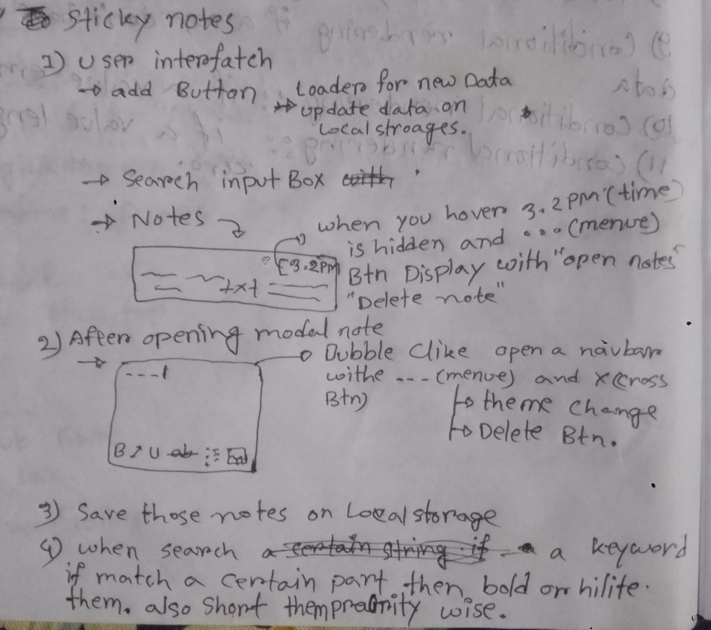
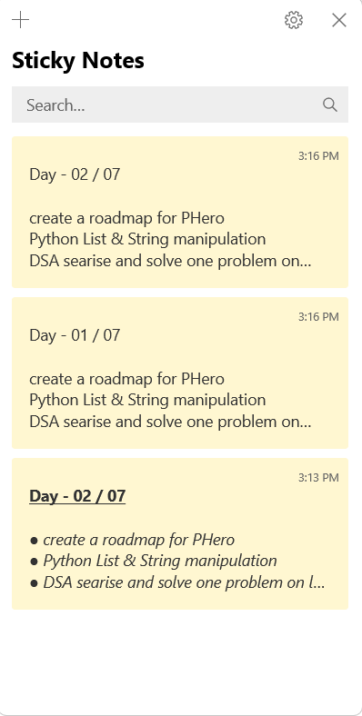
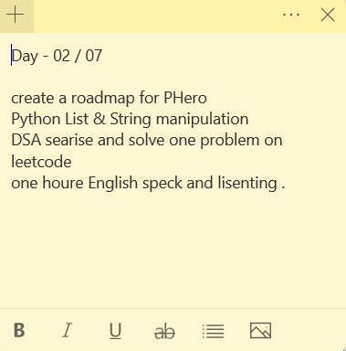
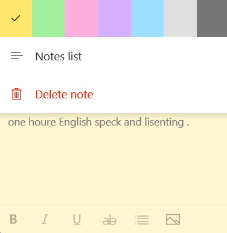

# Sticky Notes Project

This is a web-based sticky notes application that allows users to create, view, and manage their notes. The project focuses on core web development concepts like **DOM manipulation**, **local storage**, and user interface design.

**Main View**

## Features

### User Interface (UI)
* **Add Button:** A button to create a new sticky note.
* **Loader:** A visual indicator to show when data is being saved or loaded from local storage.
* **Search Input Box:** A field to search for specific notes.
* **Notes Section:** The main area where all the sticky notes are displayed.

### Functionality
* **DOM Manipulation:**
    * **Interactive Notes:** When a user hovers over a note, the timestamp is hidden and a menu button (`...`) appears. Clicking this menu button reveals options to **open** or **delete** the note.
    * **Modal View:** Clicking on a note or the "open note" option displays the full note content in a modal window.
* **Loader Feature:**
    * A loader or a temporary message confirms to the user that their data has been successfully saved to local storage, providing clear feedback.
* **Searching:**
    * The search input box allows users to find notes based on keywords.
    * Matching keywords within the notes are **highlighted** to make them easy to spot.
    * Notes with matching keywords are sorted and displayed with a higher priority.
* **Local Storage:**
    * All notes are stored in the browser's **local storage**.
    * The data is saved in a structured format, for example:
        `[{time: "3.2 PM", note: "This is my first note."}, {time: "3.5 PM", note: "Another note here."}, {}]`

## Screenshots

Here are some screenshots of the application in action.
**Note in a Modal**

